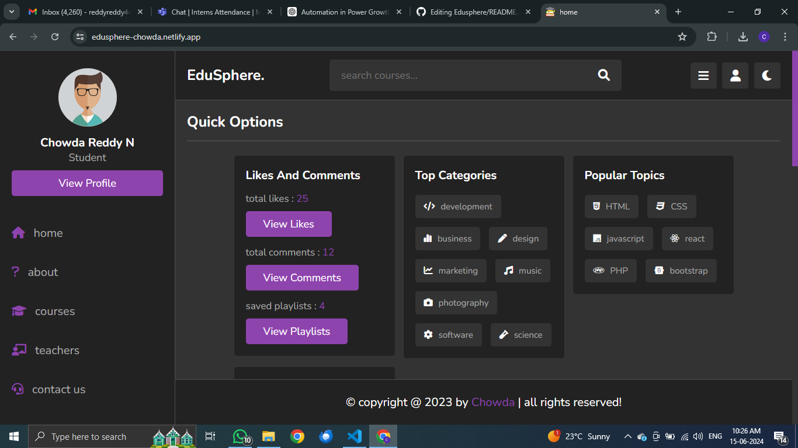

# Edusphere



## Project Overview

Edusphere is an educational platform designed to provide a seamless and engaging learning experience. This landing page project is part of my project work  and showcases my skills in web development using modern technologies.

### Deployed Link

Explore the live site: [Edusphere](https://edusphere-chowda.netlify.app/)

### GitHub Repository

View the repository: [Edusphere Repository](https://github.com/Chowdaa/Edusphere)

## Technologies Used

- **HTML5**
- **CSS3**
- **JavaScript**
- **Bootstrap**
- **Netlify** (for deployment)

## Features

- **Responsive Design**: The landing page is fully responsive and looks great on all devices.
- **User-Friendly Navigation**: Intuitive and easy-to-use navigation bar.
- **Engaging Visuals**: High-quality images and icons to enhance user experience.
- **Interactive Elements**: Hover effects and clickable elements to engage users.

## Steps to Deploy on Netlify

1. **Fork the Repository**: Click the 'Fork' button at the top right of this repository page to create a copy of this repository in your GitHub account.
2. **Clone the Repository**: Use the following command to clone the repository to your local machine.
   ```bash
   git clone https://github.com/chowdaa/Edusphere.git
3. Navigate to the Project Directory: Move into the project directory.
  cd Edusphere
4. Make Necessary Changes: Customize the project according to your requirements.
5. Push Changes to GitHub: Push the changes to your GitHub repository.
    git add .
    git commit -m "Your commit message"
    git push origin main
6. Deploy to [Netlify](https://www.netlify.com/):
    Log in to your Netlify account.
    Click on 'New site from Git'.
    Choose GitHub as the provider.
    Authenticate with GitHub and select your repository.
    Click on 'Deploy Site'.

Additional Information
For any queries or support, feel free to reach out via your- reddyreddy44477@gmail.com
